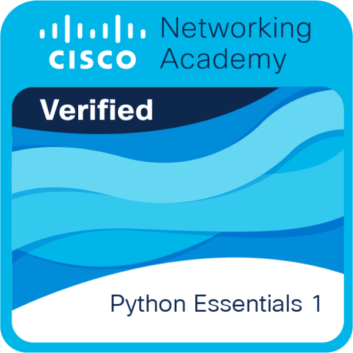

  <h1>Olá! Eu sou a Marian 💖</h1>

---

<table>
  <tr>
    <td width="45%" valign="top">
      <h3>Sobre mim</h3>
      
Graduanda em <b>ADS & Engenharia de Software</b>. Apaixonada por transformar lógica em <b>automações inteligentes</b>. Atualmente, foco meus estudos no ecossistema <b>Full Stack</b> e na integração de <b>IA</b> para otimizar processos e criar soluções escaláveis.

      <ul>
        <li>🎓 Graduanda em ADS & Engenharia de Software</li>
        <li>👩‍💻 Desenvolvedora Full Stack em formação</li>
        <li>🚀 Entusiasta de IA</li>
      </ul>
       
      
    </td>
    
    <td width="10%"></td>
    
    <td width="45%" valign="top">
      <h3>Tecnologias & Ferramentas</h3>
      
      
      
      
      
      
      
      
      
        
      

      
      <h3>Certificações</h3>
      
      
    </td>
  </tr>
</table>

---

  Feito por Marian ✨ 

